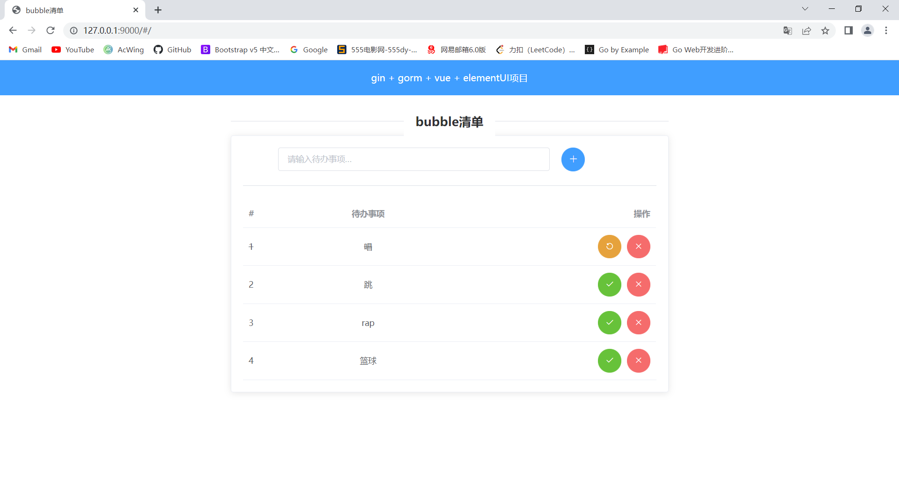

# bubble清单
## 下载
```bash
git clone git@github.com:sh1nyru0/bubble.git
```
## 后端
### 配置MySQL
1. 在你的数据库中执行以下命令，创建本项目所用的数据库：
```sql
CREATE DATABASE bubble DEFAULT CHARSET=utf8mb4;
```
2. 在`bubble/conf/config.ini`文件中按如下提示配置数据库连接信息。

```ini
port = 9000
release = false

[mysql]
user = 你的数据库用户名
password = 你的数据库密码
host = 你的数据库host地址
port = 你的数据库端口
db = bubble
```

### 编译
```bash
go build
```

### 执行

Mac/Unix：
```bash
./bubble conf/config.ini
```
Windows:
```bash
bubble.exe conf/config.ini
```

## 前端

### Project setup
```
npm install
```

### Compiles and hot-reloads for development
```
npm run serve
```

### Compiles and minifies for production
```
npm run build
```

### 效果预览
启动之后，使用浏览器打开`http://127.0.0.1:9000/`即可。
